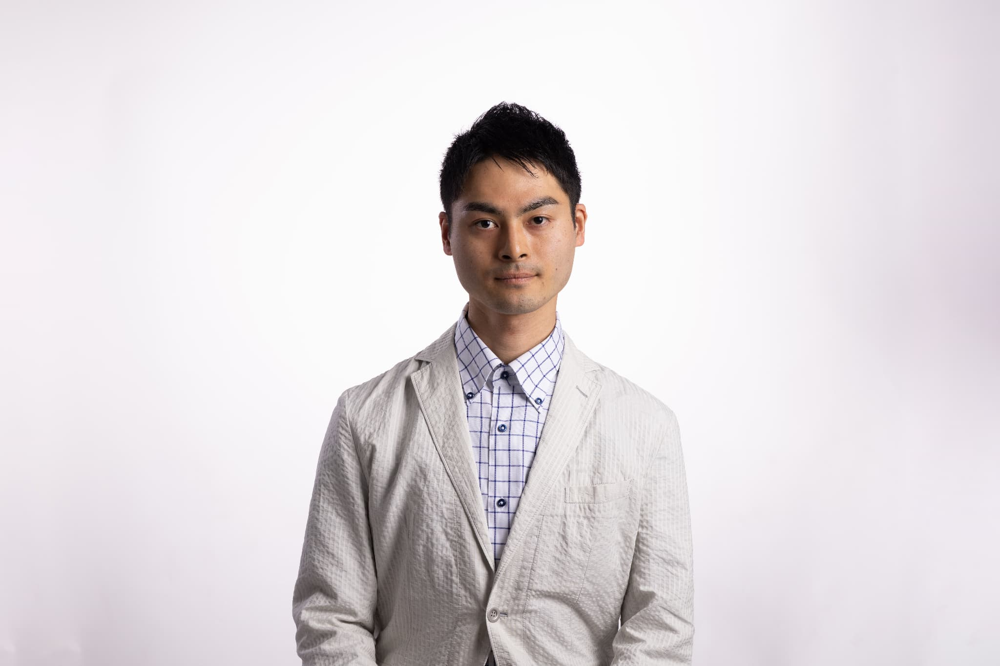

# 上野 友裕のポートフォリオサイト

はじめまして。多くのサイトがある中、上野のポートフォリオについて興味を持っていただきありがとうございます。

データサイエンスや機械学習に強い関心があり、また、エンジニアリングが得意です。

仕事は画像処理でディープラーニングや古典的な画像処理の手法を業務で取り扱っています。

趣味は勉強会運営、テニス、オセロ、バックパッカー（国内）です。

2022年度は沖縄に4回行きました。

# データサイエンス

得意な分野は、画像認識（インスタンスセグメンテーション、PoseDetection、分類問題など)です。

最近は自然言語処理に加え、pyspark、Hadoop、Hiveなどのツールの使い方についても勉強を進めております。

# 勉強会運営
Hokuriku AI Meetup という勉強会や、それ以前は金沢人工知能勉強会(KAIM)などを主催しておりました。

# テニス
草トーナメントに出場し、初級の部ではあるものの、市民大会のシングルスでなんとか優勝できました。。

# オセロ

神奈川県中学生オセロ名人です。（参加者はあまり多くなかったのですが...orz）
オンラインでの公式戦が増えたら良いなと思っております。

最近は友人とZoomで飲みながらオセロをしております。
